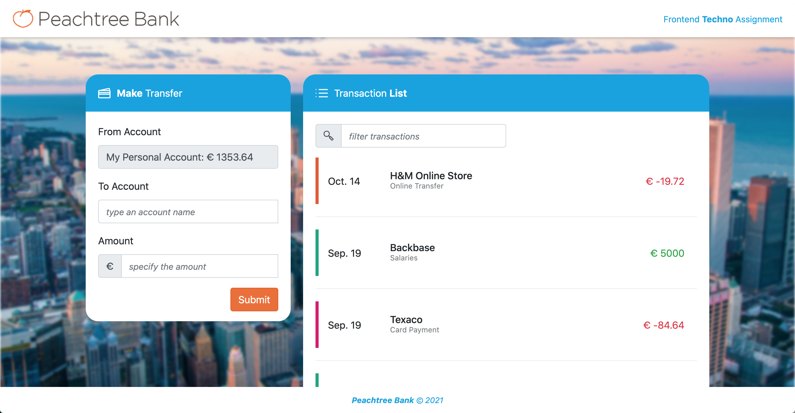

# Peachy-Tree Bank

## Development server

Run `npm install`

Run `ng serve` for a dev server. Navigate to `http://localhost:4200/`.

## Some things to improve

1. Improve test coverage - focus on the transaction page and transaction list
2. Make it look better on smaller screen sizes
3. Fetch real data
4. Test other browsers - Devloped and Tested on Chrome only
5. Better match the designs - Use correct font, scroll transfer list items etc.
